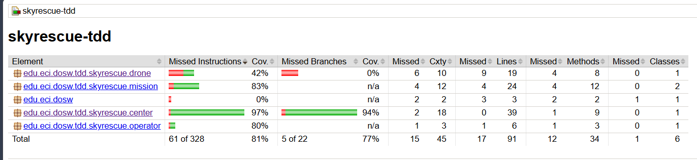
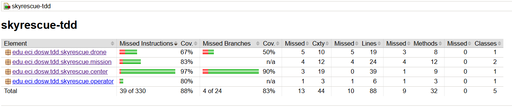

# DOSW_Lab5_Aguirre_Gonzalez_Nieto-

### Ciclo TDD - Finalización Misión (`CompleteMission`)

**RED:** Se agregaron 2 nuevas pruebas unitarias (shouldCompleteActiveMissionSuccessfully y shouldThrowIllegalArgumentExceptionWhenMissionDoesNotExist). Al ejecutar mvn test, la suite reporta Tests run: 9, Failures: 2, confirmando que la lógica para completar una misión aún no estaba implementada en el centro de rescate y no se validaba la existencia de la misión.

[Prueba fallando]

**GREEN:** Se implementó el método completeMission en RescueCenter.java utilizando Streams para validar la existencia de la misión con IllegalArgumentException, actualizar el estado a COMPLETED, asignar la fecha de cierre (LocalDateTime.now()) y liberar el dron correspondiente marcándolo como disponible. Al reejecutar mvn test, la suite pasa a Tests run: 9, Failures: 0 (BUILD SUCCESS), confirmando el cumplimiento de todas las pruebas.

[Prueba pasando]

**REFACTOR:** Se optimizó la búsqueda y actualización de la misión en RescueCenter.java mediante encadenamiento de métodos sobre Optional (orElseThrow), garantizando un código expresivo, libre de verificaciones nulas manuales y desacoplado de la gestión directa del estado del dron.

### Cobertura con JaCoCo

## Evidencia de cobertura

### Primera ejecución

### Cobertura final

